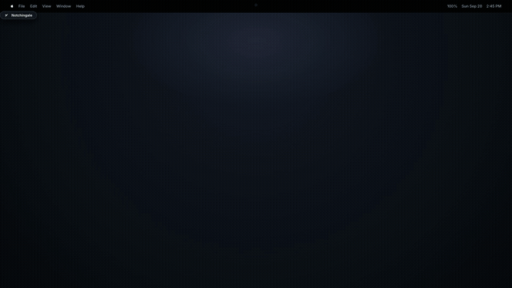

<p align="center">
  <picture>
    <source media="(prefers-color-scheme: dark)" srcset="Sources/Notchingale/Resources/logo-dark.svg">
    <source media="(prefers-color-scheme: light)" srcset="Sources/Notchingale/Resources/logo.svg">
    
  </picture>
</p>

# Notchingale

A native macOS workspace utility pinned right to the hardware notch. Notchingale brings your daily tasks, focus timer, scratchpad, and calendar events into a single hover-activated popover.

<p align="center">
  <a href="https://github.com/akshatsonic/notchingale/raw/main/media/notchingale-launch.mp4">
    
  </a>
  <br>
  <a href="https://github.com/akshatsonic/notchingale/raw/main/media/notchingale-launch.mp4">
    ▶ Watch the Full 1080p Launch Video with Audio (18s MP4)
  </a>
</p>

Built with Swift, SwiftUI, and AppKit for macOS 13 and later.

## Why Notchingale

Most macOS menu-bar apps suffer from the same problem: when your menu bar fills up with status icons, macOS quietly hides them in an invisible overflow space with no arrow or indicator to reveal them.

Notchingale skips `NSStatusItem` entirely. It draws a dedicated hardware pill pinned to the top-center of your primary display, directly hugging the physical camera notch (or centered at the top on non-notch Macs).

- **Zero-click hover reveal**: Move your pointer over the notch pill to unfold the workspace downward. It stays open while your pointer remains over the pill or dashboard, closing smoothly 350ms after you move away.
- **GPU mask animation**: The dashboard window appears instantly at full dimensions and uses a Core Animation mask layer to unfold downward from the pill. No stuttering, frame-resizing glitches, or repetitive SwiftUI layout passes.
- **Live notch countdown**: When you start a focus session and move away, the pill extends slightly below the camera cutout and displays a live dot-matrix timer right under your webcam.
- **Detachable window**: Need the workspace visible on a second monitor while you work? Click "Open app" in the top bar to pop the entire workspace into a standard resizable desktop window.

## The workspace

The dashboard organizes your day across four pastel cards. You can toggle any card on or off in Settings, and the window dynamically resizes to fit only what you have enabled.

### Today's tasks (sage green)
- Add tasks instantly with the quick-entry field (`Return` to commit).
- Drag and drop tasks to reorder your priority list.
- Check off items as you finish them, with a live `done / total` counter in the corner.
- Right-click any task to trigger an inline focus session (15, 25, 45, 60 minutes, or custom duration), set a reminder (in 30 minutes, 1 hour, this evening, tomorrow morning), rename, duplicate, or move to tomorrow.
- Tasks tied to an ongoing timer display a live "Active" badge.

### Focus (lavender)
- Large dot-matrix countdown timer built from custom vector geometry without requiring external font files.
- Start, pause, or complete sessions early with dedicated controls.
- Quick duration adjustments when running independent focus intervals.
- Cumulative daily focus tracker that logs your total productive minutes.

### Notepad (ochre)
- Date-stamped local scratchpad that autosaves on every keystroke.
- Integrated word counter in the card footer.
- Focused text editor with clean typography tuned for contrast against pastel paper textures.

### Events and reminders (slate blue)
- Direct integration with Apple Calendar via EventKit.
- Active meeting detection that flags events happening right now.
- Click any event to open a detail card showing time spans, attendees, locations, and auto-detected links for video calls and phone numbers.
- Reminders view that aggregates tasks scheduled with reminder alerts for the day.

## Insights and history

Click over to the **Insights** tab to inspect your productivity trends:
- Daily summary cards for completed tasks, total focus time, and completed sessions.
- 7-day focus chart showing daily focus volume.
- 14-day history view. While the main workspace keeps things tidy by only carrying over pending tasks, the history view lets you step back into any day over the past two weeks to see everything you finished.

## Settings and privacy

Click the gear icon in the top navigation bar to adjust preferences:
- Toggle individual cards (Tasks, Focus, Notepad, Events). The dashboard recalculates its width on the fly without awkward spacing or clipping.
- Enable or disable launch at login through `SMAppService`.
- Reset local data with a safety confirmation prompt.

Notchingale is completely local and private. Your tasks, notes, focus history, and settings are saved as plain JSON files in `~/Library/Application Support/Notchingale/`. There are no accounts, no analytics, no external servers, and no background sync services.

## Requirements

- macOS 13.0 (Ventura) or later
- Apple Silicon or Intel Mac
- Swift 5.9+ toolchain (included with Xcode or Command Line Tools)

## Quick start

### Build and launch

Clone the repository and run the build script from Terminal:

```bash
./build_app.sh
open Notchingale.app
```

The build script compiles a release binary via Swift Package Manager, bundles the vector logo, generates the multi-resolution `AppIcon.icns`, packages `Notchingale.app`, and applies an ad-hoc signature so macOS can grant notification permissions.

### First launch notes

Because the build is signed locally with an ad-hoc identity rather than an Apple Developer certificate, macOS Gatekeeper may flag it on first run:
1. Locate `Notchingale.app` in Finder.
2. Right-click (or Control-click) `Notchingale.app` and choose **Open**.
3. Click **Open** in the confirmation dialog.

### Permissions

- **Calendar**: When the Events card first opens, macOS will ask for Calendar permission. Granting access allows Notchingale to read today's schedule via EventKit. If denied, the section remains empty.
- **Notifications**: When you start your first task reminder or timer, macOS prompts for notification permissions to display completion banners and audio alerts.

### How to quit

Right-click the notch pill at the top of your screen and select **Quit Notchingale**, or run:

```bash
killall Notchingale
```

## Development and Xcode

You can open and edit Notchingale directly in Xcode:

```bash
open Package.swift
```

Xcode loads the folder as a native Swift Package. Press `Cmd + R` to build and run the executable target during development.

To create a clean release bundle for testing or daily use, always use `./build_app.sh`, which bundles the resources and icon assets into the final `.app` bundle.

## Project structure

```
Notchingale/
├── Package.swift                         # Swift package manifest
├── Info.plist                            # App bundle metadata and usage descriptions
├── build_app.sh                          # Release build, icon generator, and packaging script
└── Sources/Notchingale/
    ├── main.swift                        # Entry point
    ├── AppDelegate.swift                 # App lifecycle, screen monitoring, hover routing
    ├── NotchTriggerWindowController.swift # Pinned notch pill window and hover tracking
    ├── DashboardWindowController.swift   # Dropdown panel with Core Animation reveal mask
    ├── MainWindowController.swift        # Standalone resizable window controller
    ├── Models.swift                      # Data models, local JSON store, focus state
    ├── AppSettings.swift                 # User preferences and card visibility state
    ├── NotificationManager.swift         # User notifications for timers and reminders
    ├── CalendarService.swift             # EventKit calendar integration
    ├── Theme.swift                       # Color palette, spacing, and corner radii
    ├── DotMatrixText.swift               # Vector dot-matrix digit renderer
    ├── AppLogo.swift                     # SVG logo loader and template tinting
    ├── ContentView.swift                 # Header navigation and tab switching
    ├── WorkspaceView.swift               # 4-card horizontal layout engine
    ├── TaskCardView.swift                # Tasks list, inline focus picker, context menus
    ├── TimerCardView.swift               # Focus timer view and duration controls
    ├── NotepadCardView.swift             # Autosaving scratchpad
    ├── EventsCardView.swift              # Calendar feed and task reminders
    ├── EventDetailPopover.swift          # Clickable event details with URL detection
    ├── InsightsView.swift                # Focus charts, metrics, and 14-day history
    ├── SettingsView.swift                # Card toggles, launch-at-login, and reset
    └── Resources/
        └── logo.svg                      # Bird logo artwork
```

## License

MIT License. Feel free to use, modify, and distribute as you see fit.
